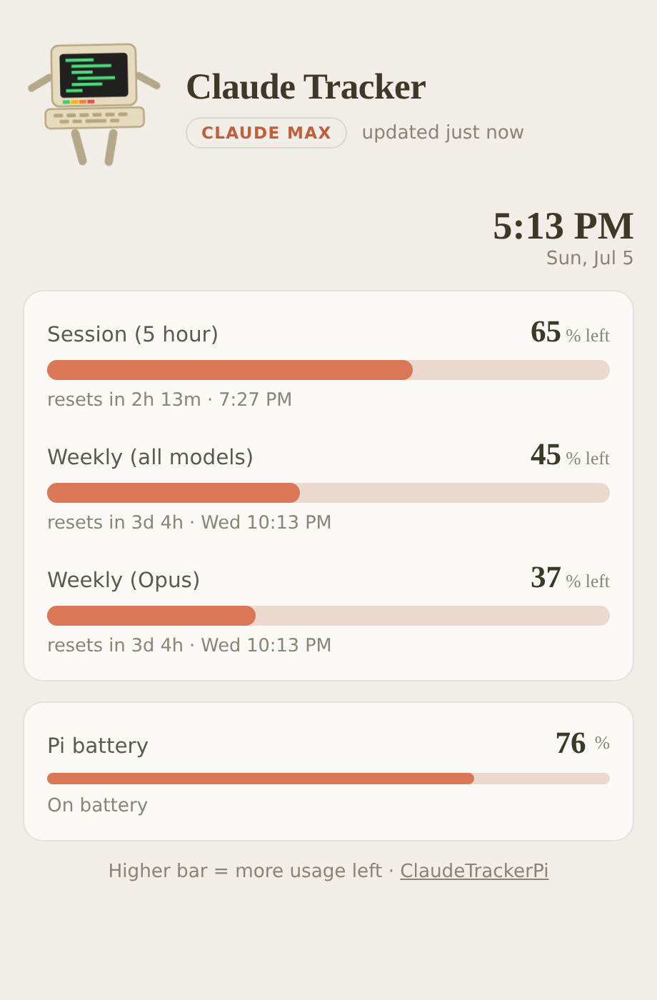
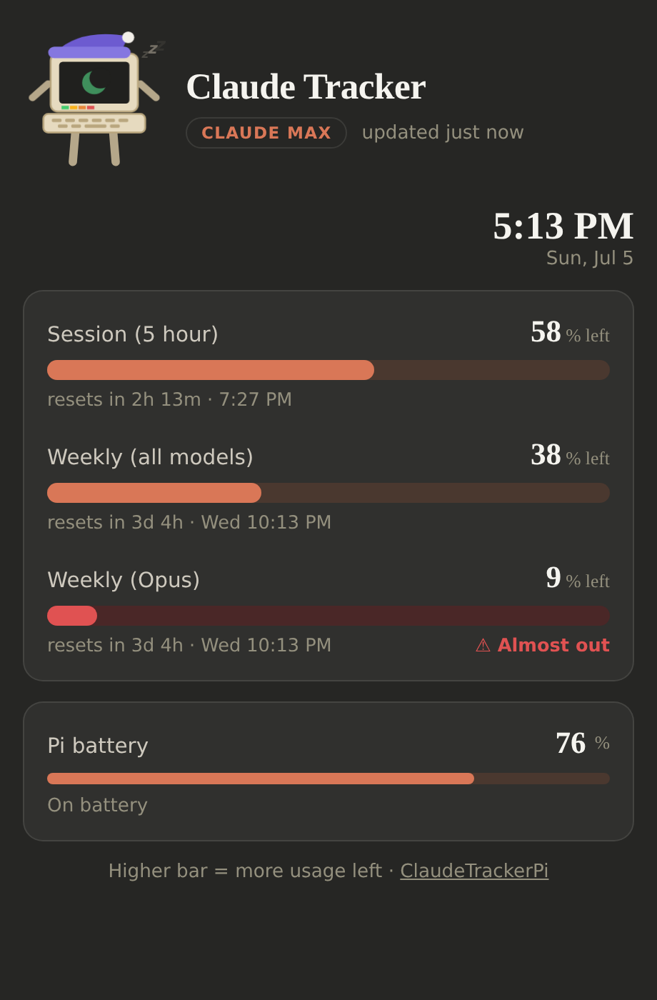
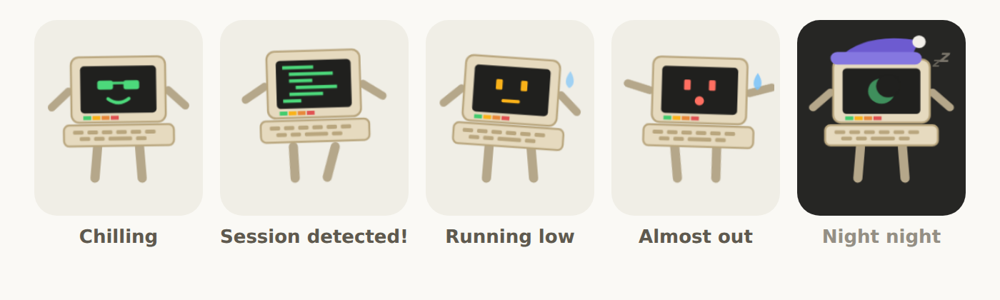

# ClaudeTrackerPi

A tiny always-on dashboard for your **Claude usage limits**, built for a
**Raspberry Pi Zero 2 W** with a **PiSugar** battery. Glance at it and know
how much usage you have left, when it resets, and whether Claude is being
used right now — no terminal, no menubar, no estimating.

<p align="center">
  
  &nbsp;
  
</p>

## What you get

- **Meters and percentages** for every usage window Claude reports (5-hour
  session, weekly, weekly Opus, …) — fuel-gauge style, so the bar shows how
  much you have **left**; amber under 30%, red under 10%
- **Reset countdowns** — live "resets in 2h 13m" plus the local clock time
- **A clock**, and Claude's own look: the warm cream claude.ai theme by day,
  its dark theme at night (on a configurable schedule)
- **PiSugar battery level** with a charging indicator
- **Pip.** The tracker's mascot: a little retro computer. Between sessions
  it chills with a sunglasses screensaver; the moment it detects you're
  actually using Claude it starts dancing while code flies across its
  screen. The screen phosphor turns amber when you're running low and red
  when you're almost out, and at night it puts on a nightcap and sleeps
  with a crescent moon on screen.

<p align="center">
  
</p>

No pip installs, no Node, no database — one Python 3 standard-library
process serving one page. It idles in a few MB of RAM on the Zero 2 W, and
you view it from any browser on your network (phone, laptop, or a small
screen on the Pi itself in kiosk mode).

## Setup (two steps)

### 1. On the Pi

```bash
git clone https://github.com/DaveEuson/ClaudeTrackerPi.git
cd ClaudeTrackerPi
./install.sh
```

That creates a `claude-tracker` systemd service that starts on boot. The
installer prints your dashboard URL, e.g. `http://raspberrypi.local:8080`.

### 2. On the computer where you use Claude Code

The tracker reads your limits with the same sign-in Claude Code uses. Copy
your credentials to the Pi with the helper script (works on macOS and Linux):

```bash
./scripts/send-credentials.sh pi@raspberrypi.local
```

That's it. Within a minute or two the meters go live. The tracker refreshes
its token automatically from then on, so this is normally a one-time step.
(If you ever log out of Claude Code or the sign-in expires, the dashboard
tells you and you just re-run the script.)

> Already run Claude Code on the Pi itself? Then skip step 2 — the tracker
> finds `~/.claude/.credentials.json` automatically.

## Try it without a Pi

```bash
python3 app/main.py --demo
```

Serves fake data on http://localhost:8080 so you can see the dashboard (and
Pip's dance moves) from any machine. Add `?night=1` to preview night mode
and `?active=0` to see Pip chilling.

## PiSugar battery

If the [PiSugar power manager](https://github.com/PiSugar/pisugar-power-manager-rs)
is installed (`wget https://cdn.pisugar.com/release/pisugar-power-manager.sh -O - | sudo bash`),
the dashboard shows a battery tile automatically. No PiSugar? The tile just
stays hidden — nothing to configure.

## Configuration (optional)

`install.sh` creates `config.json`; the defaults are fine for almost everyone.

| Key | Default | What it does |
|-----|---------|--------------|
| `port` | `8080` | Dashboard port |
| `usage_poll_seconds` | `120` | How often to ask Anthropic for usage |
| `battery_poll_seconds` | `20` | How often to read the PiSugar |
| `credentials_path` | `null` | Custom credentials location (auto-detected otherwise) |
| `night_start` | `"22:00"` | When the screen dims and Pip goes to sleep |
| `night_end` | `"07:00"` | When Pip wakes up |

## Kiosk mode (optional)

Got a little screen on the Pi? Show the dashboard full-screen on boot:

```bash
sudo apt install -y chromium-browser
chromium-browser --kiosk --app=http://localhost:8080
```

## How it works

- `app/anthropic_usage.py` calls the same usage endpoint Claude Code's
  `/usage` command uses (`api.anthropic.com/api/oauth/usage`) with your
  OAuth token, and refreshes the token when it expires. Real percentages
  from Anthropic — no token counting or estimating.
- `app/pisugar.py` talks to `pisugar-server` on `127.0.0.1:8423`.
- `app/main.py` polls both in the background and serves the dashboard plus
  a small `/api/status` JSON endpoint.
- "Session detected" means usage went up between two polls; Pip keeps
  dancing for 15 minutes after the last increase, then goes back to
  chilling.
- Day/night uses the browser's clock. Fonts are Claude's brand stacks with
  safe fallbacks (Georgia / system sans), so nothing is downloaded and
  nothing needs a license.

## Troubleshooting

```bash
journalctl -u claude-tracker -f    # live logs
systemctl restart claude-tracker   # restart after editing config.json
```

The dashboard itself surfaces the most common problems (no credentials yet,
expired sign-in, Anthropic unreachable) in a banner at the top.
